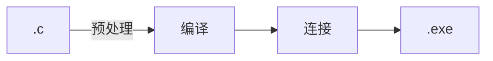

## 枚举的特性
构造中的枚举常量本身是有值，类似于直接Define了他。默认从0开始递增，如果有显示初始化，那么下一个元素从上一个元素的值递增。
```C
#include <stdio.h>
enum Alpha{
	A,
	B,
	C,
	D = 9,
	E,
	F
};
int main(){
	enum Alpha d = A;
	printf("%d\n",A);
	printf("%d\n",B);
	printf("%d\n",D);
	printf("%d\n",E);
	//类似于#Define的直接引用
}
```
```C
0
1
9
10
```
## 部分优点
- 便于调试。在此过程中，如果用的是定义宏，那么预处理的时候值其实都已经被替换了。而如果使用枚举的话，都是保持原样的。

- 更加易于理解。如果输入的操作数有一个明确的意义，我们可以将他们对应起来，提高可读性。