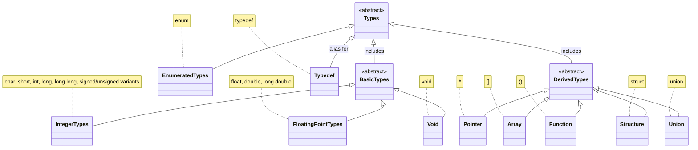

C语言中的所有类型包括基本类型`（整数如char、short、int、long、long long及其signed/unsigned变体，浮点如float、double、long double，以及void）、枚举类型（enum）、派生类型（指针*、数组[]、函数类型()、结构struct、联合union），以及通过typedef定义的类型别名。`

## 整型家族

我们知道整型家族有以下几种：

- char
- short \[int]
- int
- long \[int]
- long long \[int]

每一类都可以再细分为**signed**和**unsighed。意味有符号和无符号**。

**字符的本质**是ASCII码，是整型，所以也归纳到了整型家族中。占1个字节。

int一般占4个字节。而long一般占4个字节(32位)或8个字节(64位)。

char a = 'c';

char是有符号还是无符号取决于编译器。在VS中是默认有符号的。
## 指针家族
参见：[[../指针、数组与传参/指针&数组#指针类型]]