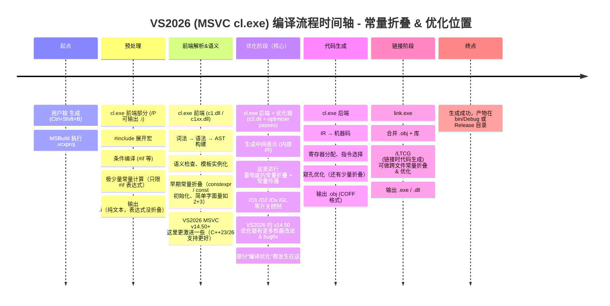

```mermaid
timeline
    title VS2026 (MSVC cl.exe) 编译流程时间轴 - 常量折叠 & 优化位置

    起点 : 用户按 生成 (Ctrl+Shift+B)
           : MSBuild 执行 .vcxproj

    预处理 : cl.exe 前端部分 (/P 可输出 .i)
             : #include 展开宏
             : 条件编译 (#if 等)
             : 极少量常量计算（只限 #if 表达式）
             : 输出 .i（纯文本，表达式没折叠）

    前端解析&语义 : cl.exe 前端 (c1.dll / c1xx.dll)
                   : 词法 → 语法 → AST 构建
                   : 语义检查、模板实例化
                   : 早期常量折叠（constexpr / const 初始化、简单字面量如 2+3）
                   : VS2026 MSVC v14.50+ 这里更激进一些（C++23/26 支持更好）

    优化阶段（核心） : cl.exe 后端 + 优化器 (c2.dll + optimizer passes)
                       : 生成中间表示 (内部 IR)
                       : 这里进行 最彻底的常量折叠 + 常量传播
                       : /O1 /O2 /Ox /GL 等开关控制
                       : VS2026 的 v14.50 优化器有更多性能改进 & bugfix
                       : 大部分“编译优化”都发生在这里

    代码生成 : cl.exe 后端
               : IR → 机器码
               : 寄存器分配、指令选择
               : 窥孔优化（还有少量折叠）
               : 输出 .obj (COFF 格式)

    链接阶段 : link.exe
               : 合并 .obj + 库
               : /LTCG (链接时代码生成) 可做跨文件常量折叠 & 优化
               : 输出 .exe / .dll

    终点 : 生成成功，产物在 bin/Debug 或 Release 目录
```