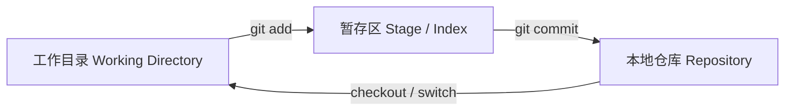
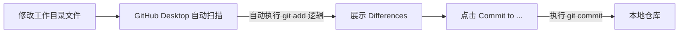
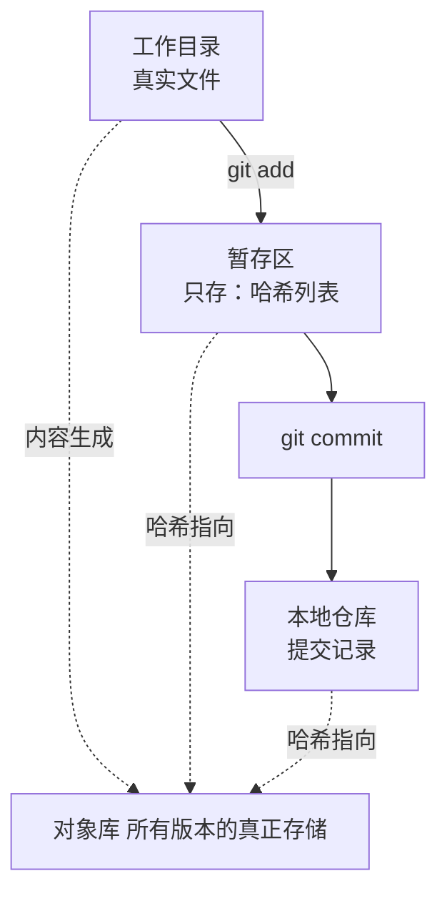

## 基础部分
### 三大区域
我们的本地Git有三个区域：工作目录、暂存区和本地仓库。

- 在git add的时候，Git会进行比对。如果已经存在且没有变化（或在.gitignore中），那么将被自动忽略。否则将被加入暂存区中
- 暂存区相当于预览提交区，用户确认无误后就可以commit了
#### GUI工具的行为
- 像GitHub Desktop这样的工具，会自动帮你进行git add并实时展示diff
- 当发生修改后，工具会自动扫描目录并将变更加入到Stage中
以下图表展示了这个过程：

### 存储划分
- 暂存区：存放文件+文件对应的哈希，指向对象库
- 工作目录：存放当前分支的真实文件
- 本地仓库：存放大量commit，指向对象库
- 对象库：存放所有版本内容

### 对象库里存什么？
对象库中存着哈希命名的四种东西：
- **blob** → **文件内容快照**（你改的代码、文本、图片）
- **tree** → 文件夹结构
- **commit** → 提交记录（作者、信息、指向 tree）
- **tag** → 版本标签
## 流程（A）
### 从Clone开始说起
当我们Clone一个仓库的时候，会发生以下几件事：
1. 将远程仓库整个复制到本地仓库
2. 把最新提交的快照拿出来写入到工作目录中，并把他们的哈希值写入到暂存区中
注：这些哈希值是预先已计算好并存在于仓库中的。
以上的这几个步骤就使得三个区域是同步的。
### 开始修改文件了
当我们在工作目录中修改了一个文件，Git并不会直接对其进行任何操作。当我们执行任何Git操作时，会先计算工作目录中所有文件的HASH值，并和暂存区的HASH值进行对比，并打上状态标签：
- 没有变化 → `unchanged`
- 工作目录更新 → `modified`
- 工作目录删了 → `deleted`
- 从来没进过 Git → `untracked`
### 提交到暂存区Stage
当我们git add的时候，Git会根据打上的状态标签执行操作。
- 标签是 `unchanged` → **直接忽略，不处理**
- 标签是 `modified / deleted / untracked` → **执行操作**
#### 具体的操作
##### 1）modified 文件
- 生成新文件快照 → 存进对象库
- 把暂存区里的哈希**更新成新哈希**
##### 2）deleted 文件
- 暂存区里标记这个文件**不再需要**
- 下一次提交就会删掉它
##### 3）untracked 新文件
- 生成文件快照 → 存进对象库
- 把它**第一次加入暂存区**
- 标签变成 `new file`
### 提交到仓库
这一步我们使用`git commit`操作，执行如下几件事：
1. 读取暂存区中的所有哈希，打包成一个commit对象（也就是我们看到的一串哈希码）
2. 将这个commit对象存进对象库
3. 让这个分支指向这个commit
4. 重置所有文件状态（让所有的标签都消失）
只有当三库的哈希一致的时候，标签才会消失。
## 流程（B）
1. 工作目录中有了一个新的文件
2. Git查暂存区中，发现不在文件列表中，标记为untracked
3. 当执行git add的时候，计算其HASH值写入到暂存区并把快照写进对象库
4. 此时状态变成了new file
5. 当执行commit的时候，将所有HASH值打包为一个对象，放入对象库
6. 让该分支指向此commit对象